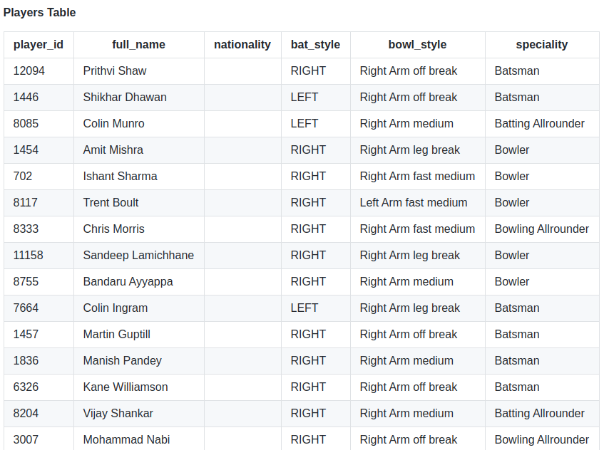
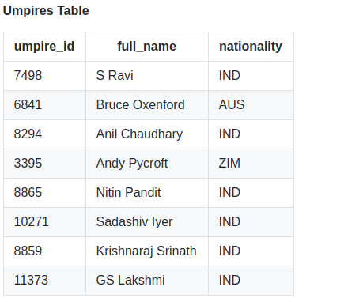
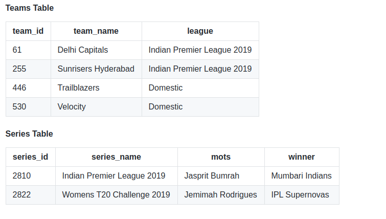
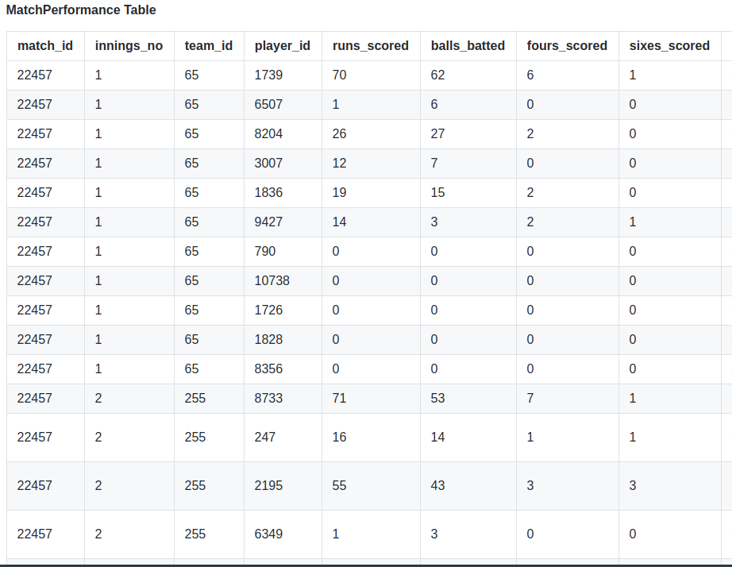

## CricketDjango
#### This project is **[Deprecated]** due to this API: https://www.cricbuzz.com/match-api/livematches.json being deprecated.

### Here's a Demo of the data it collected:

#### Players Table
|player_id|full_name          |nationality|bat_style|bowl_style           |speciality        |
|---------|-------------------|-----------|---------|---------------------|------------------|
|12094    |Prithvi Shaw       |           |RIGHT    |Right Arm off break  |Batsman           |
|1446     |Shikhar Dhawan     |           |LEFT     |Right Arm off break  |Batsman           |
|8085     |Colin Munro        |           |LEFT     |Right Arm medium     |Batting Allrounder|
|1454     |Amit Mishra        |           |RIGHT    |Right Arm leg break  |Bowler            |
|702      |Ishant Sharma      |           |RIGHT    |Right Arm fast medium|Bowler            |
|8117     |Trent Boult        |           |RIGHT    |Left Arm fast medium |Bowler            |
|8333     |Chris Morris       |           |RIGHT    |Right Arm fast medium|Bowling Allrounder|
|11158    |Sandeep Lamichhane |           |RIGHT    |Right Arm leg break  |Bowler            |
|8755     |Bandaru Ayyappa    |           |RIGHT    |Right Arm medium     |Bowler            |
|7664     |Colin Ingram       |           |LEFT     |Right Arm leg break  |Batsman           |
|1457     |Martin Guptill     |           |RIGHT    |Right Arm off break  |Batsman           |
|1836     |Manish Pandey      |           |RIGHT    |Right Arm medium     |Batsman           |
|6326     |Kane Williamson    |           |RIGHT    |Right Arm off break  |Batsman           |
|8204     |Vijay Shankar      |           |RIGHT    |Right Arm medium     |Batting Allrounder|
|3007     |Mohammad Nabi      |           |RIGHT    |Right Arm off break  |Bowling Allrounder|

#### Umpires Table
|umpire_id|full_name          |nationality|
|---------|-------------------|-----------|
|7498     |S Ravi             |IND        |
|6841     |Bruce Oxenford     |AUS        |
|8294     |Anil Chaudhary     |IND        |
|3395     |Andy Pycroft       |ZIM        |
|8865     |Nitin Pandit       |IND        |
|10271    |Sadashiv Iyer      |IND        |
|8859     |Krishnaraj Srinath |IND        |
|11373    |GS Lakshmi         |IND        |

#### MatchPerformance Table 
|match_id|innings_no         |team_id|player_id|runs_scored|balls_batted|fours_scored|sixes_scored|overs_bowled|maidens|runs_conceded|wickets_taken|no_balls|wides|final_out_condition             |
|--------|-------------------|-------|---------|-----------|------------|------------|------------|------------|-------|-------------|-------------|--------|-----|--------------------------------|
|22457   |1                  |65     |1739     |70         |62          |6           |1           |0           |0      |0            |0            |0       |0    |not out                         |
|22457   |1                  |65     |6507     |1          |6           |0           |0           |0           |0      |0            |0            |0       |0    |c Ashwin b Mujeeb               |
|22457   |1                  |65     |8204     |26         |27          |2           |0           |0           |0      |0            |0            |0       |0    |c Rahul b Ashwin                |
|22457   |1                  |65     |3007     |12         |7           |0           |0           |3.5         |0      |42           |0            |0       |0    |run out (Ashwin)                |
|22457   |1                  |65     |1836     |19         |15          |2           |0           |0           |0      |0            |0            |0       |0    |c (sub)Nair b Shami             |
|22457   |1                  |65     |9427     |14         |3           |2           |1           |0           |0      |0            |0            |0       |0    |not out                         |
|22457   |1                  |65     |790      |0          |0           |0           |0           |0           |0      |0            |0            |0       |0    |Did not bat                     |
|22457   |1                  |65     |10738    |0          |0           |0           |0           |4.0         |0      |20           |1            |0       |0    |Did not bat                     |
|22457   |1                  |65     |1726     |0          |0           |0           |0           |4.0         |0      |25           |0            |0       |0    |Did not bat                     |
|22457   |1                  |65     |1828     |0          |0           |0           |0           |4.0         |0      |42           |1            |0       |0    |Did not bat                     |
|22457   |1                  |65     |8356     |0          |0           |0           |0           |4.0         |0      |21           |2            |0       |0    |Did not bat                     |
|22457   |2                  |255    |8733     |71         |53          |7           |1           |0           |0      |0            |0            |0       |0    |not out                         |
|22457   |2                  |255    |247      |16         |14          |1           |1           |0           |0      |0            |0            |0       |0    |c Deepak Hooda b Rashid Khan    |
|22457   |2                  |255    |2195     |55         |43          |3           |3           |0           |0      |0            |0            |0       |0    |c Vijay Shankar b Sandeep Sharma|
|22457   |2                  |255    |6349     |1          |3           |0           |0           |0           |0      |0            |0            |0       |0    |c Deepak Hooda b Sandeep Sharma |
|22457   |2                  |255    |6319     |2          |3           |0           |0           |0           |0      |0            |0            |0       |0    |c Deepak Hooda b S Kaul         |
|22457   |2                  |255    |10420    |5          |3           |0           |0           |4.0         |0      |30           |0            |0       |0    |not out                         |
|22457   |2                  |255    |9429     |0          |0           |0           |0           |0           |0      |0            |0            |0       |0    |Did not bat                     |
|22457   |2                  |255    |1593     |0          |0           |0           |0           |4.0         |0      |30           |1            |0       |0    |Did not bat                     |
|22457   |2                  |255    |8924     |0          |0           |0           |0           |4.0         |0      |21           |0            |0       |1    |Did not bat                     |
|22457   |2                  |255    |7909     |0          |0           |0           |0           |4.0         |0      |30           |1            |0       |0    |Did not bat                     |
|22457   |2                  |255    |12071    |0          |0           |0           |0           |4.0         |0      |34           |1            |0       |2    |Did not bat                     |

#### Teams Table
|team_id|team_name          |league|
|-------|-------------------|------|
|61     |Delhi Capitals     |Indian Premier League 2019|
|255    |Sunrisers Hyderabad|Indian Premier League 2019|
|446    |Trailblazers       |Domestic|
|530    |Velocity           |Domestic|

#### Series Table
|series_id|series_name        |mots|winner                    |
|---------|-------------------|----|--------------------------|
|2810     |Indian Premier League 2019|  Jasprit Bumrah  |Mumbari Indians          |
|2822     |Womens T20 Challenge 2019|   Jemimah Rodrigues   |     IPL Supernovas       |

<!--

-->
